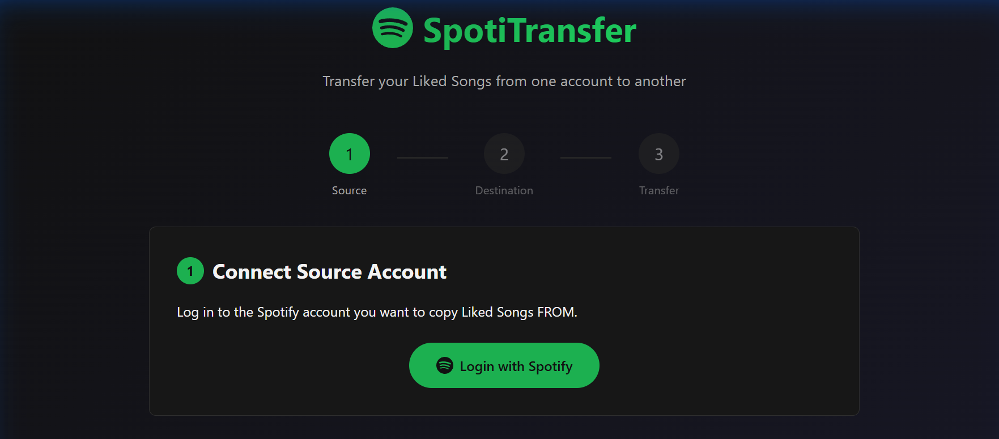

# SpotiTransfer


A web application to transfer your Liked Songs from one Spotify account to another while **preserving the chronological order**.



## Features

- 🎵 **Transfer all Liked Songs** between Spotify accounts
- 📅 **Preserve chronological order** - tracks appear in the same order as the source (~80-90% accurate, 1-2 tracks per 10 may be slightly out of order due to API timing)
- 🔐 **Secure OAuth 2.0** authentication with Spotify
- 📊 **Real-time progress** with Server-Sent Events (SSE)
- 🎨 **Modern dark UI** inspired by Spotify's design
- 📱 **Responsive** - works on desktop and mobile

## Prerequisites

- Python 3.8 or higher
- A Spotify account (free or premium)
- A Spotify Developer application (created during setup)

## Installation

1. **Clone the repository**
   ```bash
   git clone https://github.com/yourusername/SpotiTransfer.git
   cd SpotiTransfer
   ```

2. **Install dependencies**
   ```bash
   pip install -r requirements.txt
   ```

3. **Run the application**
   ```bash
   python app.py
   ```

4. **Open your browser**
   ```
   http://127.0.0.1:5000
   ```

## Setup Guide

### Creating a Spotify Developer App

1. Go to [developer.spotify.com/dashboard](https://developer.spotify.com/dashboard)
2. Log in with your Spotify account
3. Click **"Create App"**
4. Fill in the details:
   - **App name**: SpotiTransfer
   - **App description**: Transfer liked songs
   - **Redirect URI**: `http://127.0.0.1:5000/callback`
5. Check "Web API" and accept the terms
6. In Settings, copy your **Client ID** and **Client Secret**

### Adding Users (Development Mode)

While your app is in development mode, you need to add users who will use it:

1. Go to your app's **Settings** → **User Management**
2. Add the email addresses of both Spotify accounts you want to use

## Usage

1. **Configure** - Enter your Spotify app credentials
2. **Connect Source** - Log in to the account you want to copy FROM
3. **Fetch Tracks** - The app retrieves all your Liked Songs
4. **Connect Destination** - Log in to the account you want to copy TO
5. **Transfer** - Watch the progress as tracks are added one by one

> ⏱️ **Note**: Transfer takes ~3 seconds per 10 tracks to preserve order.  
> For 2000 tracks, expect ~10 minutes.

## How It Works

SpotiTransfer uses the Spotify Web API to:
1. Fetch all saved tracks from the source account using pagination
2. Sort tracks by their original `added_at` timestamp (oldest first)
3. Add tracks one-by-one to the destination account
4. Use small delays between additions to ensure Spotify processes them in order

## Tech Stack

- **Backend**: Flask (Python)
- **Frontend**: Vanilla HTML/CSS/JavaScript
- **API**: Spotify Web API
- **Authentication**: OAuth 2.0 Authorization Code Flow
- **Real-time Updates**: Server-Sent Events (SSE)

## Project Structure

```
SpotiTransfer/
├── app.py              # Flask application
├── auth.py             # OAuth authentication
├── spotify_service.py  # Spotify API interactions
├── requirements.txt    # Python dependencies
├── static/
│   └── style.css       # Spotify-themed dark UI
└── templates/
    ├── index.html      # Main dashboard
    ├── setup.html      # Configuration guide
    ├── fetch.html      # Track fetching progress
    ├── tracks.html     # Track list preview
    ├── transfer.html   # Transfer progress
    └── error.html      # Error page
```

## Environment Variables

Create a `.env` file based on `.env.example`:

```env
SPOTIPY_CLIENT_ID=your_client_id
SPOTIPY_CLIENT_SECRET=your_client_secret
SPOTIPY_REDIRECT_URI=http://127.0.0.1:5000/callback
FLASK_SECRET_KEY=your_random_secret_key
```

## Limitations

- Spotify API rate limits apply (~100 requests/minute)
- Both accounts must be added to your Spotify Developer app in development mode
- Track order preservation requires one-by-one insertion (slower but accurate)

## Contributing

Contributions are welcome! Feel free to:
- Report bugs
- Suggest features
- Submit pull requests

## License

MIT License - feel free to use this project for personal or commercial purposes.

## Acknowledgments

- [Spotipy](https://spotipy.readthedocs.io/) - Spotify Web API wrapper for Python
- [Flask](https://flask.palletsprojects.com/) - Python web framework
